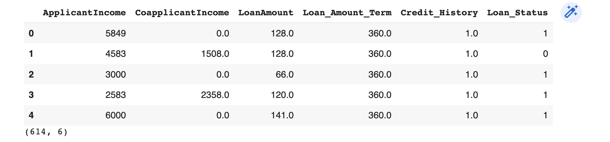
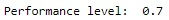
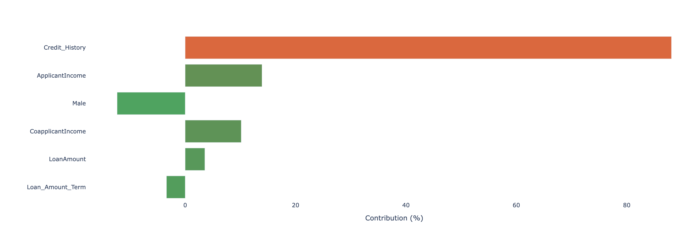
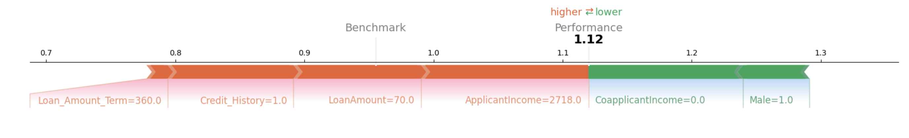

**XPER (eXplainable PERformance)** is a methodology designed to measure the specific contribution of the input features to the predictive performance of any econometric or machine learning model. XPER is built on Shapley values and interpretability tools developed in machine learning but with the distinct objective of focusing on model performance (AUC, $R^2$) and not on model predictions ($\hat{y}$). XPER has as a special case the standard explainability method in Machine Learning (SHAP).


## 01 Install 🚀
The library has been tested on Linux, MacOSX and Windows. It relies on the following Python modules:

Pandas
Numpy
Scipy
Scikit-learn

XPER can be installed from [PyPI](https://pypi.org/project/XPER):

<pre>
pip install XPER
</pre>

#### Post installation check
After a correct installation, you should be able to import the module without errors:

```python
import XPER
```

## 02 XPER example on sampled data step by step ➡️


#### 1️⃣ Load the Data 💽


```python

import XPER
from XPER.datasets.load_data import loan_status
from sklearn.model_selection import train_test_split
loan = loan_status().iloc[:, :7]

X = loan.drop(columns='Loan_Status')
Y = pd.DataFrame(loan['Loan_Status'])

X_train, X_test, y_train, y_test = train_test_split(X, Y, test_size=0.15, random_state=3)
```


--->

#### 2️⃣ Load the trained model or train your model ⚙️

```python
from xgboost import XGBClassifier
import xgboost as xgb

# Create an XGBoost classifier object
gridXGBOOST = xgb.XGBClassifier(eval_metric="error")

# Train the XGBoost classifier on the training data
model = gridXGBOOST.fit(X_train, y_train)

```

#### 3️⃣ Monitor Performance 📈

```python
# Convert the training and testing data from Pandas DataFrames to NumPy arrays
X_train = X_train.values
y_train = y_train.values
X_test = X_test.values
y_test = y_test.values

from XPER.compute.Performance import evaluate_model_performance

# Define the evaluation metric(s) to be used
Eval_Metric = ["Precision"]

# Evaluate the model performance using the specified metric(s)
PM = evaluate_model_performance(Eval_Metric, X_train, y_train, X_test, y_test, model)

# Print the performance metrics
print("Performance Metrics: ", round(PM, 3))

```



```python
from XPER.models.EM import *
from XPER.models.Performance import calculate_XPER_values

# Calculate XPER values for the model's performance
result = calculate_XPER_values(X_test, y_test, model, Eval_Metric)
```

#### 4 Visualisation

```python
import pandas as pd
from XPER.viz.Visualisation import visualizationClass as viz

labels = list(loan.drop(columns='Loan_Status').columns)
```

##### Bar plot 

```python
viz.bar_plot(XPER_values=result, X_test=pd.DataFrame(X_test), labels=labels, p=p,percentage=True)
```


##### Force plot

```python
viz.force_plot(XPER_values=result, instance=1, X_test=X_test, variable_name=labels, figsize=(16,4))
```


## 03 Acknowledgements

The contributors to this library are 
* [Sullivan Hué](https://www.amse-aixmarseille.fr/fr/membres/hu%C3%A9)
* [Christophe Hurlin](https://sites.google.com/view/christophe-hurlin/home)
* [Christophe Pérignon](https://www.hec.edu/fr/faculty-research/faculty-directory/faculty-member/perignon-christophe)
* [Sébastien Saurin](https://papers.ssrn.com/sol3/cf_dev/AbsByAuth.cfm?per_id=4582330)


## 04 References

1. *XPER:* Hué, Sullivan, Hurlin, Christophe, Pérignon, Christophe and Saurin Sébastien. "Explainable Performance (XPER): Measuring the Driving Forces of Predictive Performance". HEC Paris Research Paper No. FIN-2022-1463, Available at SSRN: https://ssrn.com/abstract=4280563 or http://dx.doi.org/10.2139/ssrn.4280563, 2022.

