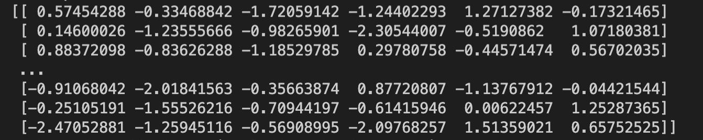
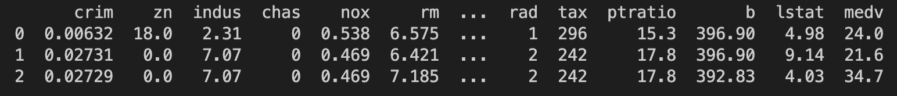
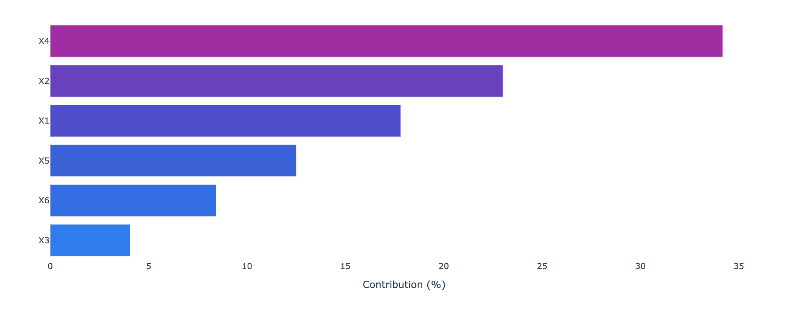
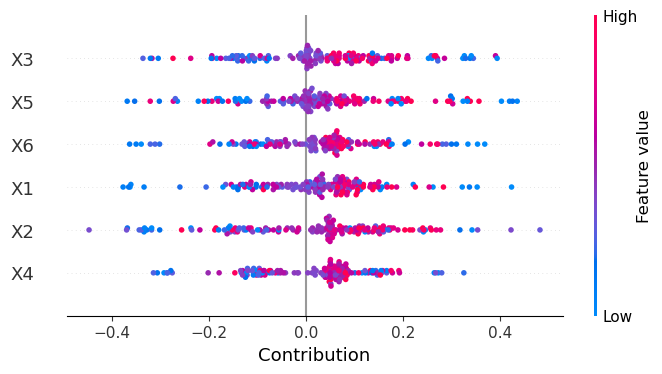
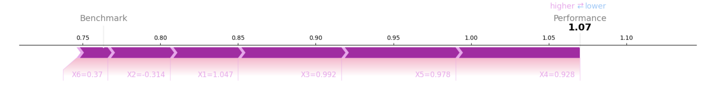

**XPER (eXplainable PERformance)** is a methodology designed to measure the specific contribution of the input features to the predictive performance of any econometric or machine learning model. XPER is built on Shapley values and interpretability tools developed in machine learning but with the distinct objective of focusing on model performance (AUC, $R^2$) and not on model predictions ($\hat{y}$). XPER has as a special case the standard explainability method in Machine Learning (SHAP).


## 01 Install 🚀
The library has been tested on Linux, MacOSX and Windows. It relies on the following Python modules:

Pandas
Numpy
Scipy
Scikit-learn

XPER can be installed from [PyPI](https://pypi.org/project/XPER):

<pre>
pip install -i https://test.pypi.org/simple/ XPER==0.0.7
</pre>

#### Post installation check
After a correct installation, you should be able to import the module without errors:

```python
import XPER
```

## 02 XPER example on sampled data step by step ➡️


#### 1️⃣ Load the Data 💽

<!--- * Option 1 --->
```python
import XPER
from XPER.datasets.sample import sample_generation

p = 6 # Number of features
N = 500 # Number of individuals
X_train, y_train, X_test, y_test, p, N, seed  = sample_generation(N=N,p=p,seed=123456)
```

<!---  

* Option 2
```python

from XPER.datasets.load_data import boston
df = boston()
df.head(3)
```


--->

#### 2️⃣ Load the trained model or train your model ⚙️

```python
import joblib
model = joblib.load('xgboost_model.joblib')
```

#### 3️⃣ Monitor Performance 📈

```python
from XPER.models.Performance import evaluate_model_performance
Eval_Metric = ["Accuracy"]
PM = evaluate_model_performance(Eval_Metric, X_train, y_train, X_test, y_test, model)
print("Performance level: ",PM)
```


```python
from XPER.models.Performance import calculate_XPER_values
CFP = None
CFN = None
result = calculate_XPER_values(X_test, y_test, model, Eval_Metric, CFP, CFN)
```

#### 4 Visualisation

```python
import pandas as pd
from XPER.viz.Visualisation import visualizationClass as viz

labels = ["X" + str(i+1) for i in range(p)]
```

##### Bar plot 

```python
viz.bar_plot(XPER_values=result, X_test=pd.DataFrame(X_test), labels=labels, p=p,percentage=True)
```


##### Beeswarn plot

```python
viz.beeswarn_plot(XPER_values=result, X_test=pd.DataFrame(X_test), labels=labels)
```


##### Force plot

```python
viz.force_plot(XPER_values=result, instance=1, X_test=X_test, variable_name=labels, figsize=(16,4))
```


## 03 Acknowledgements

The contributors to this library are 
* [Sullivan Hué](https://www.amse-aixmarseille.fr/fr/membres/hu%C3%A9)
* [Christophe Hurlin](https://sites.google.com/view/christophe-hurlin/home)
* [Christophe Pérignon](https://www.hec.edu/fr/faculty-research/faculty-directory/faculty-member/perignon-christophe)
* [Sébastien Saurin](https://papers.ssrn.com/sol3/cf_dev/AbsByAuth.cfm?per_id=4582330)


## 04 References

1. *XPER:* Hué, Sullivan, Hurlin, Christophe, Pérignon, Christophe and Saurin Sébastien. "Explainable Performance (XPER): Measuring the Driving Forces of Predictive Performance". HEC Paris Research Paper No. FIN-2022-1463, Available at SSRN: https://ssrn.com/abstract=4280563 or http://dx.doi.org/10.2139/ssrn.4280563, 2022.

