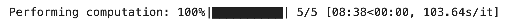
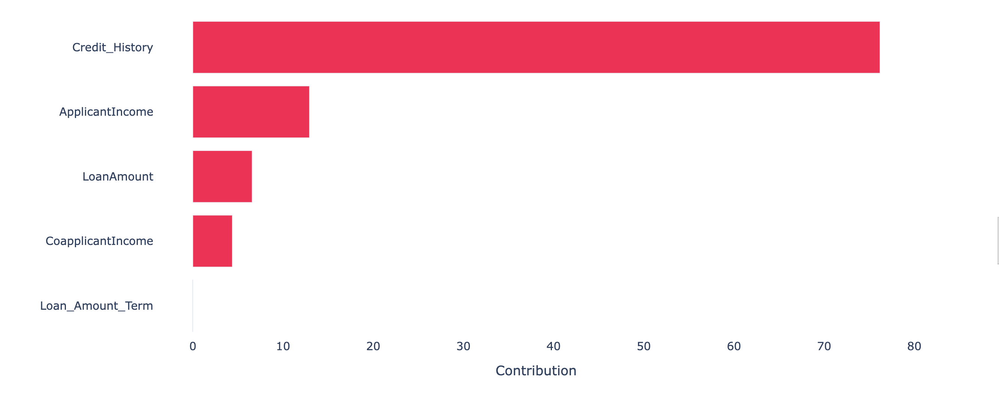
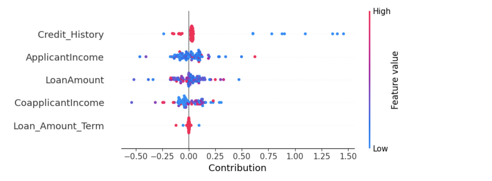

**XPER (eXplainable PERformance)** is a methodology designed to measure the specific contribution of the input features to the predictive performance of any econometric or machine learning model. XPER is built on Shapley values and interpretability tools developed in machine learning but with the distinct objective of focusing on model performance (AUC, $R^2$) and not on model predictions ($\hat{y}$). XPER has as a special case the standard explainability method in Machine Learning (SHAP).

 
### 00 Colab Examples:
* Classification on Loan Data 🎯
[](https://colab.research.google.com/drive/1K-_wSENq-s1PUZys-cyJ8zIViRd0gdl2?usp=sharing)


* Regression on Boston Housing 🎯
[](https://colab.research.google.com/drive/16Jahf7JbRB2Y62xXbaE617k9GU5cD1Nk?usp=sharing)

### 01 Install 🚀
The library has been tested on Linux, MacOSX and Windows. It relies on the following Python modules:

Pandas
Numpy
Scipy
Scikit-learn

XPER can be installed from [PyPI](https://pypi.org/project/XPER):

<pre>
pip install XPER
</pre>

#### Post installation check
After a correct installation, you should be able to import the module without errors:

```python
import XPER
```

### 02 XPER example on sampled data step by step ➡️


#### 1️⃣ Load the Data 💽


```python

import XPER
from XPER.datasets.load_data import loan_status
import pandas as pd
from sklearn.model_selection import train_test_split

loan = loan_status().iloc[:, :6]

X = loan.drop(columns='Loan_Status')
Y = pd.DataFrame(loan['Loan_Status'])

X_train, X_test, y_train, y_test = train_test_split(X, Y, test_size=0.15, random_state=3)
```


#### 2️⃣ Load the trained model or train your model ⚙️

```python
from xgboost import XGBClassifier
import xgboost as xgb

# Create an XGBoost classifier object
gridXGBOOST = xgb.XGBClassifier(eval_metric="error")

# Train the XGBoost classifier on the training data
model = gridXGBOOST.fit(X_train, y_train)

```

#### 3️⃣ Monitor Performance 📈

```python
from XPER.compute.Performance import ModelPerformance

# Define the evaluation metric(s) to be used
XPER = ModelPerformance(X_train, y_train, X_test, y_test, model)

# Evaluate the model performance using the specified metric(s)
PM = XPER.evaluate(["AUC"])

# Print the performance metrics
print("Performance Metrics: ", round(PM, 3))

```


**For use cases above 10 feature variables it is advised to use the default option kernel=True for computation efficiency** ➡️

```python
# Option 1 - Kernel True
# Calculate XPER values for the model's performance
XPER_values = XPER.calculate_XPER_values(["AUC"])
```


```python
# Option 2 - Kernel False
# Calculate XPER values for the model's performance
XPER_values = XPER.calculate_XPER_values(["AUC"],kernel=False)
```


#### 4️⃣ Visualisation 📊

```python
import pandas as pd
from XPER.viz.Visualisation import visualizationClass as viz

labels = list(loan.drop(columns='Loan_Status').columns)
```

##### Bar plot 

```python
viz.bar_plot(XPER_values=XPER_values, X_test=pd.DataFrame(X_test), labels=labels, p=6,percentage=True)
```



##### Beeswarn plot

```python
viz.beeswarn_plot(XPER_values=XPER_values,X_test=pd.DataFrame(X_test),labels=labels)
```


##### Force plot

```python
viz.force_plot(XPER_values=XPER_values, instance=1, X_test=X_test, variable_name=labels, figsize=(16,4))
```


### 03 Acknowledgements

The contributors to this library are 
* [Sullivan Hué](https://www.amse-aixmarseille.fr/fr/membres/hu%C3%A9)
* [Christophe Hurlin](https://sites.google.com/view/christophe-hurlin/home)
* [Christophe Pérignon](https://www.hec.edu/fr/faculty-research/faculty-directory/faculty-member/perignon-christophe)
* [Sébastien Saurin](https://papers.ssrn.com/sol3/cf_dev/AbsByAuth.cfm?per_id=4582330)
* [Awais Sani](https://www.linkedin.com/in/awais-hussain-sani-87a35757/)
* [Gaëtan Brison](https://www.linkedin.com/in/gaetan-brison/)


### 04 Reference

Hué, Sullivan, Hurlin, Christophe, Pérignon, Christophe and Saurin, Sébastien. "Measuring the Driving Forces of Predictive Performance: Application to Credit Scoring". HEC Paris Research Paper No. FIN-2022-1463, Available at https://ssrn.com/abstract=4280563 or https://arxiv.org/abs/2212.05866, 2023.

